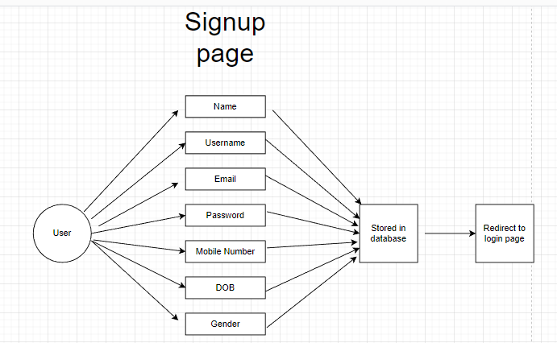
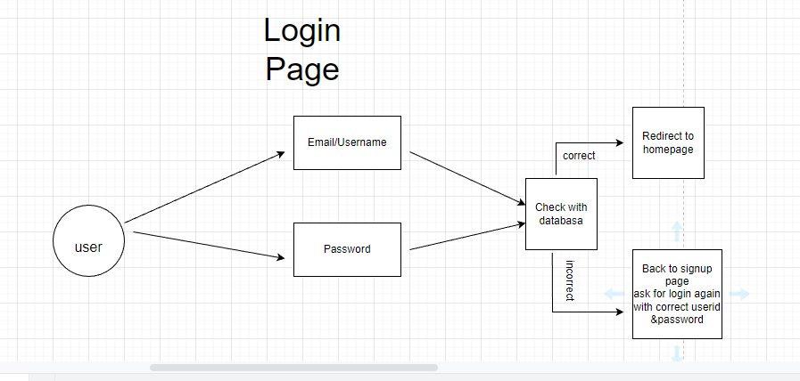
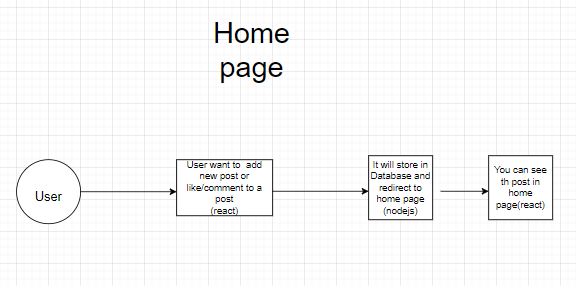
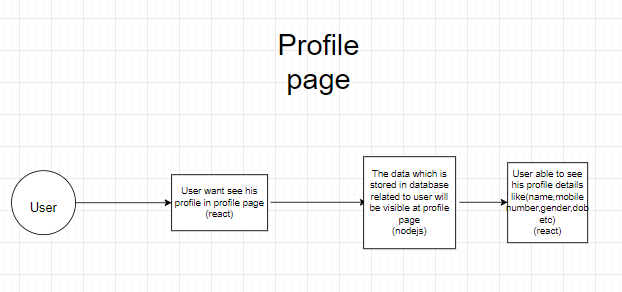
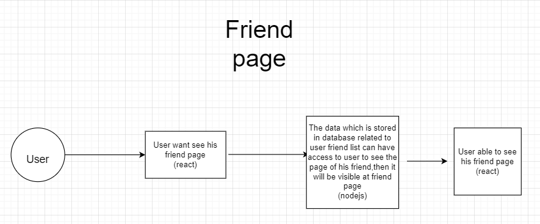
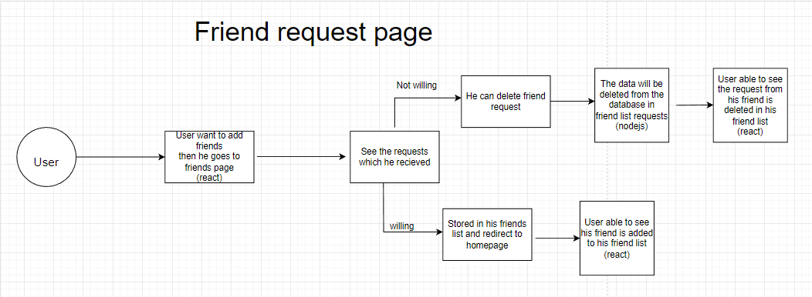

# Social media Flatform where connecting each other

##### we are creating a flatform where everyone meets and make friends,where we can post,like,comment.

<br>

> ## Problem Statement

<br>

#### To create a flatform where everyone meets and make friends and they can do post,like and comment.Users need to create their account with their details and need to login with their details.And users can be able to see their profile page.

<br>

#### Features

- Login/Signup
  - Users should be able to signup with their basic details
    - name, mobile number, email, password, DOB, gender, profile picture,Username,Password
  - After signing up, users must be able to login with their username and password
    (while logging in database check with those username,password.if they are correct then user can able to login)
- After logging in users must be taken to the home page ( posts page )
- Should have a Posts page

  - Users can see their post and their friends posts here
  - Users can add/edit/delete their own posts
    - Post can have images, description, name, hashtags
  - Users can comment/like their posts and other user's posts

- Should have a profile page
  - user can see their profile picture(while uploading user put a restriction whether the picture is jpg or png only)
  - User can view their own profile details here
  - Users should be able to edit their profile details
    - name, mobile number, DOB, gender
- Should have a Friends page
  - Users should be able to view their list of friends
  - Users should have the ability to see people who are not friends, and send them friend request
  - Users should be able accept friend requets from others
- theme changing option like dark/light

<br>

## Proposed solution

#### Build a application which will contain 3 parts. Frontend ( What the user will interact with ), Backend ( Where we will serve content for our frontend ) and Database ( Where we will store data necessary for our application ).

<br>

## Architectural diagram


<br>

## Technologies used

- NodeJs
  - It can be used as both frontend and backend.By using nodejs we can connect the database to the app.We are able to see the home page(where the posts),profile page(details about the user),able to delete the posts,able to add new posts etc.We connect css page to change the colourful view of the app.We use routes to go other pages and also used automatic redirecting/rendering to homepage.To use nodejs we need to have inbuilt-packages and modules.
- ReactJs
  - Reactjs used for building user interfaces based on UI components.It used for frontend purpose.Its aim is to allow developers to easily create fast user interfaces for websites and applications alike.By using react we can go to the which page we want by using routes and id which is we provided.In those pages we are able to add the information,adding pictures etc.we are able to see our provided info here.And we can delete the info which is we provided.By using react we can add css designs,we are able to style and layout web pages.To use Reactjs we need to have inbuilt-packages and modules.
- MongoDB
  - It is used for database purpose.It created schemas which is the information provided in the app.

<br>

## MongoDB Specifications

- MongoDB is an open source NoSQL database management program.
- MongoDB is a tool that can manage document-oriented information, store or retrieve information.
- today as the backend data store of many high-profile businesses and organizations such as Forbes, Facebook, Google, IBM, Twitter, and many more.
- MongoDB can serve diverse sets of data and multiple purposes within a single application.
- JSON is widely used across for frontend and API communication. It only makes sense for the database to use the same protocol.

#### You will find the list of schemas below

<br>

### Schema

- what is schema
  - It is the overall description of the database.
  - Schema is same for whole database.
  - Does not change Frequently.
  - Defines the basic structure of the database i.e how the data will be stored in the database.
  - A database schema contains schema objects that may include tables, fields, packages, views, relationships, primary key, foreign key

### Users Schema

```
{
  signup:{
    email: string,
    name: string,
    password: string,
    mobile: string,
    Uid:int,
    Gender:string,
    photo:jpg or png  ,
    username:characters,
    },

  login:{
    email/username: string,
    password:characters ,
    uid:

    }
  profile:{
    email: string,
    name: string,
    password: string,
    mobile: string,
    Uid:int,
    Gender:string,
    photo: jpg or png,
    username:characters,

    },
  logout:{
    email:characters,
    password:characters ,
    username:characters,
    uid:characters,
    logout:true
    }

}

}

```

### User Post Schema

```

{
postid:{
username:characters,
type:mongoose,schema,types,objectid,
required:true,
photo:[png,jpg],
uid:
},
comment:{
type:string
},
description:{
type:string,
required:true
},
deletecomment:{
deletecomment:true
}
like:{
type:emoji
}

}

```

### Friend's page Schema

```

{
page:{
username:characters,
objectid: ,
friendname: string,
friendpage: objectid,
},
postid:{
username:characters,
type:mongoose,schema,types,objectid,
required:true,
friendname: string,
friendpage: objectid,
getpost:true
},
comment:{
type:string
},
description:{
type:string,
required:true
},
deletecomment:{
deletecomment:true
}
like:{
type:emoji
}
}

```

<br>

## NodeJs Specifications

#### You will find the list routes below

<br>

### User Routes

1. #### GET user/signup

Request body -

```

{
username:string
dateofbirth:int
gender:string
mobilenumber:int
email:string
password:
profile: jpg or png
}

```

Response body ( 200 ) -

```

{
signuppage: {
username:string
profile: jpg or png, ( Required )
dateofbirth:int
gender:string
mobilenumber:int
email:string
password:
uid:int
}
}

```

```

{
error: {
type:string // please signup first
}
}

```

2. #### POST /user/login

Request body -

```

{
email: string, ( Required )
password: string, ( Required, Must be atleast 8 characters )
}

```

Response body ( 200 ) -

```

{
userDetails: {
email: string,
name: string,
mobile: string,
uid:
}
}

```

```

{
error: {
password: string, // Example - password: "must be atleast 8 characters"
}
}

```

3. #### GET /post

Request body -

```

{
photo: jpg or png, ( Required )
description:string,(Required),
}

```

Response body ( 200 ) -

```

{
newpost: {
username:characters,
password:characters,
email:characters,
photo : jpg or png,
description: string,
comment: string,
uid:

}
}

```

```

{
error: {
type:string // no posts available
}
}

```

4. #### PUT /post

Request body -

```

{
photo: jpg or png, ( Required )
description:string,(Required),
comment:string
}

```

Response body ( 200 ) -

```

{
putposts: {
username:characters,
photo : jpg or png,
description: string,
comment: string,
uid:
}
}

```

```

{
error: {
type:string // no posts available
}
}

```

5. #### DELETE /post

Request body -

```

{
photo: jpg or png, ( Required )
description:string,(Required),
}

```

Response body ( 200 ) -

```

{
deletepost: {
username:characters,
password:characters,
email:characters,
photo : jpg or png,
description: string,
comment: string,
uid:

}
}

```

```

{
error: {
type:string // no posts available
}
}

```

6. #### PUT /post/comment

Request body -

```

{
comment: string
}

```

Response body ( 200 ) -

```

{
comment: {
email: string,
name: string,
mobile: string,
uid: ,
photo:jpg or png,
comment:string
}
}

```

```

{
error: {
type:string //comment it correctly
}
}

```

7. #### DELETE /post/comment

Request body -

```

{
comment: string
}

```

Response body ( 200 ) -

```

{
deletecomment: {
email: string,
name: string,
mobile: string,
uid: ,
photo:jpg or png,
comment:string
}
}

```

```

{
error: {
type:string //No comments which you posted
}
}

```

8. #### GET /friendid

Request body -

```

{
username:characters,
}

```

Response body ( 200 ) -

```

{
friendid: {
username:characters,
uid:

}
}

```

```

{
error: {
type:string // no page available
}
}

```

9. #### GET /friendid/post

Request body -

```

{
username:characters,
photo: jpg or png, ( Required )
description:string,(Required),
}

```

Response body ( 200 ) -

```

{
friendpost: {
username:characters,
photo : jpg or png,
description: string,
uid:

}
}

```

```

{
error: {
type:string // no posts available
}
}

```

10. #### PUT /friendid/post/comment

Request body -

```

{
username:characters
photo:jpg or png
comment: string
}

```

Response body ( 200 ) -

```

{
comment: {
username: string,
uid: ,
photo:jpg or png,
comment:string
}
}

```

```

{
error: {
type:string //no posts available
}
}

```

11. #### DELETE /friendid/post/comment

Request body -

```

{
photo: jpg or png, ( Required )
description:string,(Required),
comment:characters
}

```

Response body ( 200 ) -

```

{
deletepost: {
username:characters,
photo : jpg or png,
description: string,
comment: string,
uid:

}
}

```

```

{
error: {
type:string // no posts available
}
}

```

12. #### GET /profile

Request body -

```

{
profile: jpg or png, ( Required )
dateofbirth:int
gender:string
mobilenumber:int
email:string
password:
}

```

Response body ( 200 ) -

```

{
profilepage: {
profile: jpg or png, ( Required )
dateofbirth:int,
gender:string,
mobilenumber:int,
email:characters,
password:characters,
uid:int
}
}

```

```

{
error: {
type:string // no details are available
}
}

```

13. #### POST /user/logout

Request body -

```

{
logout:username/email
}

```

Response body ( 200 ) -

```

{
userlogout: {
email: string,
name: string,
mobile: string,
uid: ,
}
}

```

```

{
error: {
password: string, // Example - password: "must be atleast 8 characters"
}
}

```

<br>

### React specifications

- Signup page
  - entering name,mobile number,dob,gender,username,password,login button
- Login Page
  - Feature to enter email,password and login
- Uploading profile page
  - user can upload their pic from thier mobile storage
  - user able to give their preferabble name
- Home page
  - user able to see the posts which he posted and his/her friends posted
  - can like/comment the post
  - can delete their own post
- User details/profile page
  - user able to see their details like name,mobilenumber,dob,gender and logout option
- Friend requests page
  - User able to get friend requests and accept friend requests from their friends
- Friend page
  - user able to see thier friends posts in their page

## Flow charts for each pages

### For Signuppage



### For Loginpage



### For Homepage



### For Profilepage



### For Friendpage



### For Friendrequestpage



# For Overall flowchart


